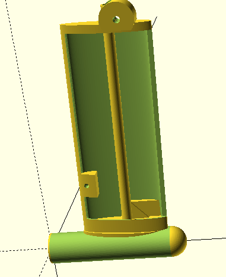
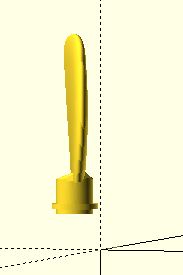
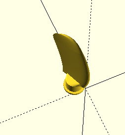
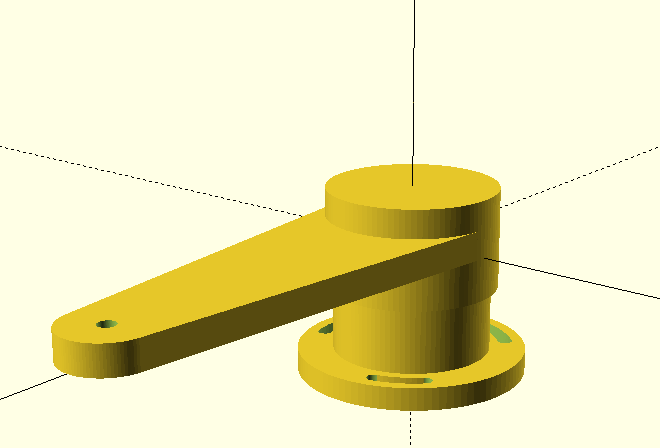
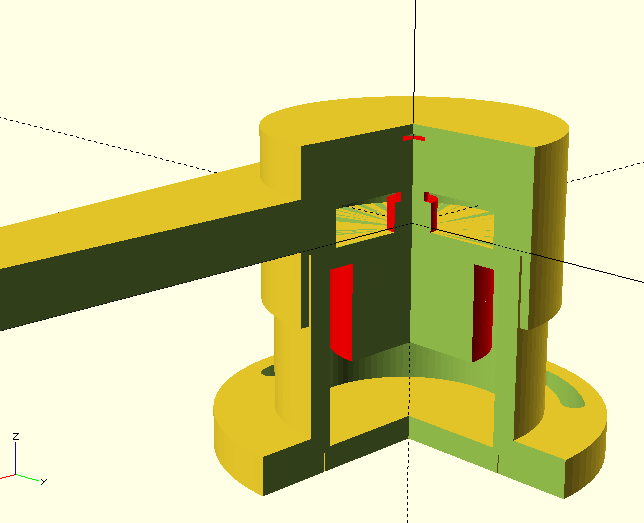

Designs and parts for 
* Solar and Hydro power generation on a boat.
* Sensor Housings
* Other parts

# Hydro Generator see hydrogenerator_v2/

This uses 2x 4800W BLDC 170KV Motors from Alien Power, mounted on a 10mm 316 shaft. A 3 blade turbine with blades printed in ABS but covered in a single layer of 3K carbon fibre. The output is expected to be arround 1kw, in the form of 2 independent 3 phase outputs which need to be rectified and controlled withe a brake. The housing is not 3d printed, but constructed from aluminium tube and plate with the leg foil build from foam and carbon fibre.

# Rudder Sensor see ruddersensor/

This is a housing for a rudder sensor. It accepepts any standard potentiomiter with a 6.35mm shaft and has a built in bearing. It prints as 3 parts in ABS.  Recommended pot is a Bourn 5K 6675 Pot https://docs-emea.rs-online.com/webdocs/1461/0900766b81461aa3.pdf part number (6657S-1-502) which has a lifetime of 10M revolutions. Other pots will do, but will not last as long in service since a rudder tends to move backwards and forwards over the central possition a lot. The design is a bit rough but remarkably simular to many other rudder sensor units available commercially. I intend to use it to replace the rudder sensor on a Jeffa linear drive connected to a Raymarine auto pilot. Once wired up it will be have to be electrically identical to a Raymarine Rudder Sensor.

# Flagstaff fittings.

These are fittings for a flagstaff made from 24mm 3K carbon fibre tube. A top cap and a colar.

